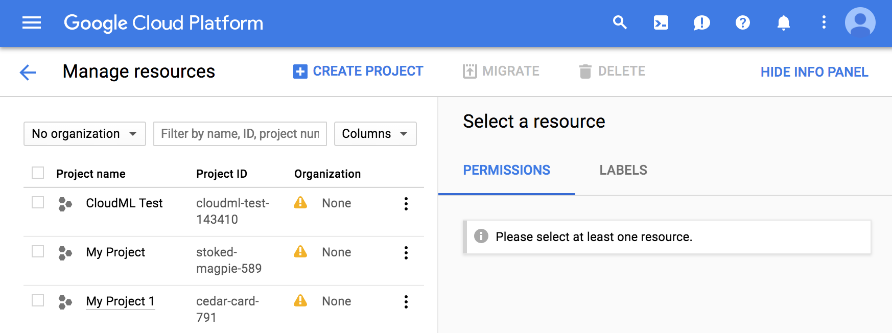
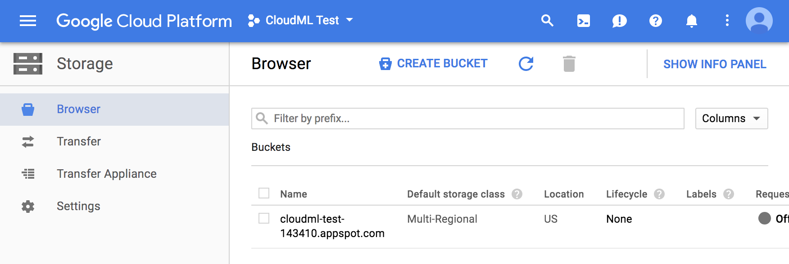

```{r setup, include=FALSE}
knitr::opts_chunk$set(echo = TRUE, eval=FALSE)
```

```{css, echo=FALSE}
.screenshot {
  margin-top: 12px;
  margin-bottom: 12px;
  width: 80%;
  border: solid 1px #cccccc;
}

#cloudml-prerequisites ol {
  margin-top: 15px;
  padding-left: 25px;
}

#cloudml-prerequisites ol>li {
  margin-bottom: 20px;
}
#cloudml-prerequisites ul>li {
  margin-bottom: 8px;
}
.list-footer {
  margin-top: 10px;
}
```

## Overview

CloudML enables you to train machine learning models at scale by running TensorFlow training applications in the cloud. Cloud ML Engine manages the computing resources that your training job needs to run, so you can focus more on your model than on hardware configuration or resource management. Your use of the training service is bounded by pricing and resource quota policy, but within those bounds, you have access to powerful scalable computing.

CloudML is designed to run your R TensorFlow training scripts with minimal alteration. This article describes the prerequisites for submitting training jobs to CloudML, how to configure a CloudML project, and finally demonstrates the basic workflow used for training.

## Prerequisites

Before you can begin training models with CloudML you need to have a **Google Cloud Account**. If you don't already have an account you can create one at <https://console.cloud.google.com>.

Next, you need to download and install the **Google Cloud SDK**, a set of utilties that enable you to interact with your Google Cloud account from the terminal or from R when using the cloudml package. The instructions for doing this vary by platform:

  - [Linux Installation](https://cloud.google.com/sdk/downloads#linux)
  - [Mac OS X Installation](https://cloud.google.com/sdk/downloads#mac)
  - [Windows Installation](https://cloud.google.com/sdk/downloads#windows)
  
A couple of important notes regarding Google Cloud SDK setup:

1) You should accept the default installation location for the SDK (e.g. ~/google-cloud-sdk) so that the cloudml R package can locate the SDK.

2) As part of SDK setup you should have run the `gcloud init` command. This command authenticates and conencts your local workstation with your Google Cloud account. If you haven't done this yet you should be sure to do so before proceeding.
  
## Google Cloud Project  
  
Whenever you work with CloudML you work within the scope of a **Google Cloud Project**. These projects map directly to the R projects containing the scripts used to train and evaluate models.

To begin a new CloudML project, start by creating a **Google Cloud Project**. You can do from the [Manage Resources](https://console.cloud.google.com/cloud-resource-manager) page on the Google Cloud Console:
   [{.screenshot}](https://console.cloud.google.com/cloud-resource-manager)   
   See the documentation on [creating and managing projects](https://cloud.google.com/resource-manager/docs/creating-managing-projects) for additional details. 

Before proceeding, you also need to create a **Cloud Storage Bucket** within your project to be used as a storage space. You can do this from the [Storage Browser](https://console.cloud.google.com/storage/browser) page on the Google Cloud Console:
   [{.screenshot}](https://console.cloud.google.com/storage/browser)  
   See the documentation on [creating buckets](https://cloud.google.com/storage/docs/creating-buckets) for additional details.

Note the name of your project and the address of the storage bucket as you will use them in the next section when setting your local R project.

## Local R Project

Now you'll create an R project on your local system that contains the scripts used to train your model, as well as configuration information that maps it to the CloudML project and storage bucket created in the previous section.

You can create a new CloudML R project using the `cloudml_init()` function. Let's assume that the CloudML project you created in the previous section is named `hellocloudml` and the storage bucket you created has the address `gs://hellocloudml`. In that case you could create the local R project with:

```{r}
library(cloudml)
cloudml_init("hellocloudml")
```

You can also customize the project name and storage bucket in the case that they differ from the name of the local project directory you create. For example:

```{r}
cloudml_init(
  "first_project", 
  project = "hellocloudml", 
  storage = "gs://hello_storage"
)
```

## Training on CloudML

The `cloudml_init()` function creates a simple Keras training script that you can submit to CloudML to ensure that everything is working correctly. To do this, switch to the project directory and execute the `cloudml_train()` function:

```{r}
setwd("hellocloudml")
cloudml_train()
```

The very first time you train a new project will take a fair amount of time (in the neighborhood of 20 minutes). This is because a large number of R packages are compiled from source as part of their installation. The good news is that all of these package installations are cached, so subsequent training runs will not have this installation overhead.


