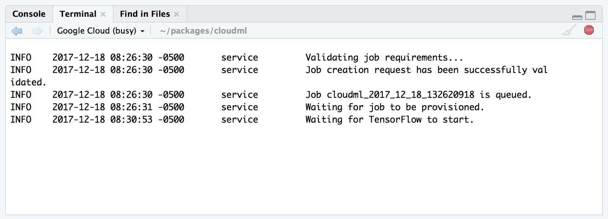

```{r setup, include=FALSE}
knitr::opts_chunk$set(echo = TRUE, eval=FALSE)
```

## Overview

{align=right width=200px style="margin-left: 10px;"}

The **cloudml** package provides an R interface to [Google Cloud Machine Learning Engine](https://cloud.google.com/ml-engine/), a managed service that enables:

* Scalable training of models built with the [keras](https://keras.rstudio.com/), [tfestimators](https://tensorflow.rstudio.com/tfestimators), and [tensorflow](https://tensorflow.rstudio.com/) R packages.

* On-demand access to training on GPUs, including the new [Tesla P100 GPUs](http://www.nvidia.com/object/tesla-p100.html) from NVIDIA&reg;. 

* Hyperparameter tuning to optmize key attributes of model architectures in order to maximize predictive accuracy.

* Deployment of trained models to the Google global prediction platform that can support thousands of users and TBs of data.

CloudML is a managed service where you pay only for the hardware resources that you use. Prices vary depending on configuration (e.g. CPU vs. GPU vs. multiple GPUs). See <https://cloud.google.com/ml-engine/pricing> for additional details. 

<div style="height: 25px;"></div>


## Google Cloud Account

Before you can begin training models with CloudML you need to have a *Google Cloud Account*. If you don't already have an account you can create one at <https://console.cloud.google.com>. 

If you are a new customer of Google Cloud you will receive a [12-month, $300 credit](https://cloud.google.com/free/docs/frequently-asked-questions#free-trial) that can be applied to your use of CloudML. In addition, Google is providing a \$200 credit for users of the R interface to CloudML (this credit applies to both new and existing customers). Use this link to [apply for the \$200 credit](https://goo.gl/mhQKHB).

## Installation

Start by installing the cloudml R package from GitHub as follows:

```r
devtools::install_github("rstudio/cloudml")
```

Then, install the *Google Cloud SDK*, a set of utilties that enable you to interact with your Google Cloud account from within R. You can install the SDK using the `gcloud_install()` function. 

```{r}
library(cloudml)
gcloud_install()
```

Note that in order to ensure that the **cloudml** package can find your installation of the SDK you should accept the default installation location (`~/`) suggested within the installer.

As part of the installation you are asked to specify a default account, project, and compute region for Google Cloud. These settings are then used automatically for all CloudML jobs. To change the default account, project, or region you can use the `gcloud_init()` function:

```{r}
gcloud_init()
```

Note that you don't need to execute `gcloud_init()` now as this was done automatically as part of `gcloud_install()`.

Once you've completed these steps you are ready to train models with CloudML!

## Training on CloudML

To train a model on CloudML, first work the training script locally (perhaps with a smaller sample of your dataset). The script can contain arbitrary R code which trains and/or evaluates a model. Once you've confirmed that things work as expected, you can submit a CloudML job to perform training in the cloud.

### Submitting a Job

To submit a job, call the `cloudml_train()` function, specifying the R script to execute for training:

```{r}
library(cloudml)
cloudml_train("train.R")
```

All of the files within the current working directory will be bundled up and sent along with the script to CloudML.

<div class="bs-callout bs-callout-warning">
Note that the very first time you submit a job to CloudML the various packages required to run your script will be compiled from source. This will make the execution time of the job considerably longer that you might expect. It's only the first job that incurs this overhead though (since the package installations are cached), and subsequent jobs will run more quickly. 
</div>

If you are using [RStudio v1.1](https://www.rstudio.com/products/rstudio/download/) or higher, then the CloudML training job is monitored (and it's results collected) using a background terminal:

{.screenshot width=725px}

### Collecting Results

When the job is complete, training results can be collected back to your local system (this is done automatically when monitoring the job using a background terminal in RStudio). A run report is displayed after the job is collected:

{.screenshot width=725px}

You can list all previous runs as a data frame using the `ls_runs()` function:

```{r}
ls_runs()
```
```
Data frame: 2 x 36 
                              run_dir metric_loss metric_acc metric_val_loss metric_val_acc
1 runs/cloudml_2018_01_09_212132525-2      0.0470     0.9866          0.1042         0.9776
2 runs/cloudml_2018_01_09_212132525-1      0.0538     0.9844          0.1070         0.9782
# ... with 31 more columns:
#   flag_dense_units1, flag_dropout1, flag_dense_units2, flag_dropout2, samples, validation_samples,
#   batch_size, epochs, epochs_completed, metrics, model, loss_function, optimizer, learning_rate, script,
#   start, end, completed, output, source_code, context, type, cloudml_console_url, cloudml_created,
#   cloudml_end, cloudml_job, cloudml_log_url, cloudml_master_type, cloudml_ml_units, cloudml_start,
#   cloudml_state
```
You can view run reports using the `view_run()` function:

```{r}
# view the latest run
view_run()

# view a specific run
view_run("runs/cloudml_2017_12_15_182614794")
```

There are many tools available to list, filter, and compare training runs. For additional information see the documentation for the [tfruns package](https://tensorflow.rstudio.com/tools/tfruns/articles/overview.html).

## Training with a GPU

By default, CloudML utilizes "standard" CPU-based instances suitable for training simple models with small to moderate datasets. You can request the use of other machine types, including ones with GPUs, using the `master_type` parameter of `cloudml_train()`. 

For example, the following would train the same model as above but with a [Tesla K80 GPU](http://www.nvidia.com/object/tesla-k80.html):

```{r}
cloudml_train("train.R", master_type = "standard_gpu")
```

To train using a [Tesla P100 GPU](http://www.nvidia.com/object/tesla-p100.html) you would specify `"standard_p100"`:

```{r}
cloudml_train("train.R", master_type = "standard_p100")
```

To train on a machine with 4 Tesla P100 GPU's you would specify `"complex_model_m_p100"`:

```{r}
cloudml_train("train.R", master_type = "complex_model_m_p100")
```

See the CloudML website for documentation on [available machine types](https://cloud.google.com/ml-engine/docs/training-overview#machine_type_table). Also note that GPU instances can be considerably more expensive that CPU ones! See the documentation on [CloudML Pricing](https://cloud.google.com/ml-engine/pricing) for details.

## Learning More

To learn more about using CloudML with R, see the following articles:

* [Training with CloudML](training.html) goes into additional depth on managing training jobs and their output.

* [Hyperparameter Tuning](tuning.html) explores how you can improve the performance of your models by running many trials with distinct hyperparameters (e.g. number and size of layers) to determine their optimal values.

* [Google Cloud Storage](storage.html) provides information on copying data between your local machine and Google Storage and also describes how to use data within Google Storage during training.

* [Deploying Models](deployment.html) describes how to deploy trained models and generate predictions from them.


